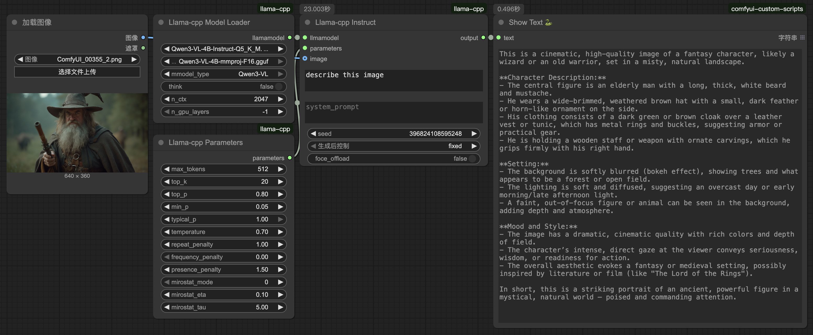

# ComfyUI-llama-cpp
在ComfyUI中基于llama.cpp原生运行LLM/VLM模型。  
**[[📃English](./README.md)]**

## 更新日志
#### 2025-11-03
- 首次上传, 支持Qwen3-VL      

## 预览
 

## 安装步骤

#### 安装节点:
```bash
cd ComfyUI/custom_nodes
git clone https://github.com/lihaoyun6/ComfyUI-llama-cpp.git
python -m pip install -r ComfyUI-llama-cpp/requirements.txt
```

> 在使用VLM模型处理图像之前, 请确保已经下载并选择了对应的`mmproj`权重.

## 致谢
- [llama-cpp-python](https://github.com/JamePeng/llama-cpp-python) @JamePeng  
- [ComfyUI-llama-cpp](https://github.com/kijai/ComfyUI-llama-cpp) @kijai
- [ComfyUI](https://github.com/comfyanonymous/ComfyUI) @comfyanonymous
